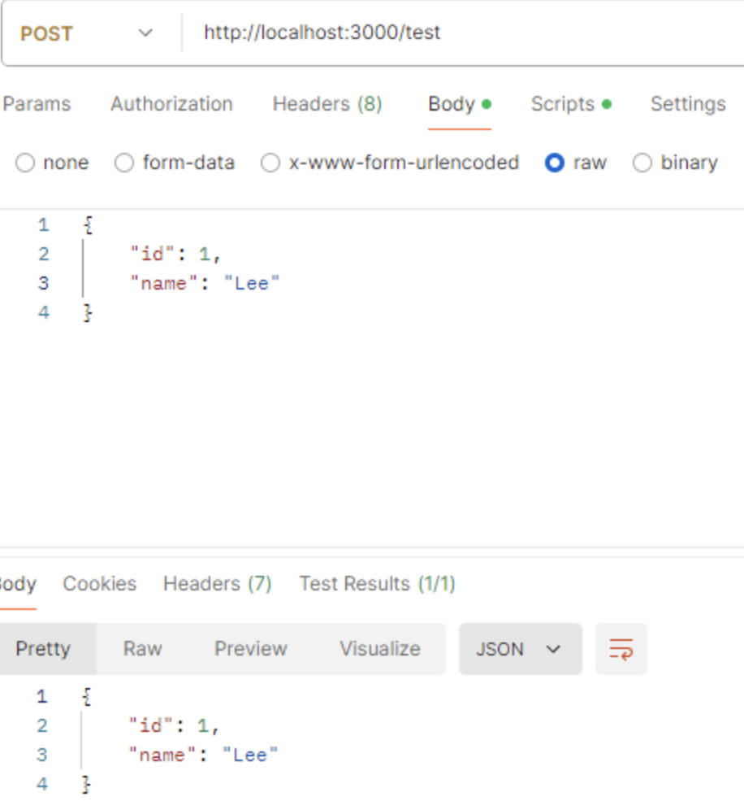
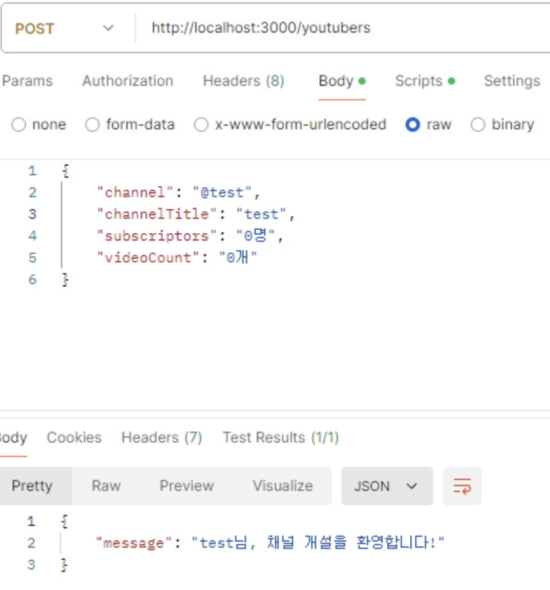
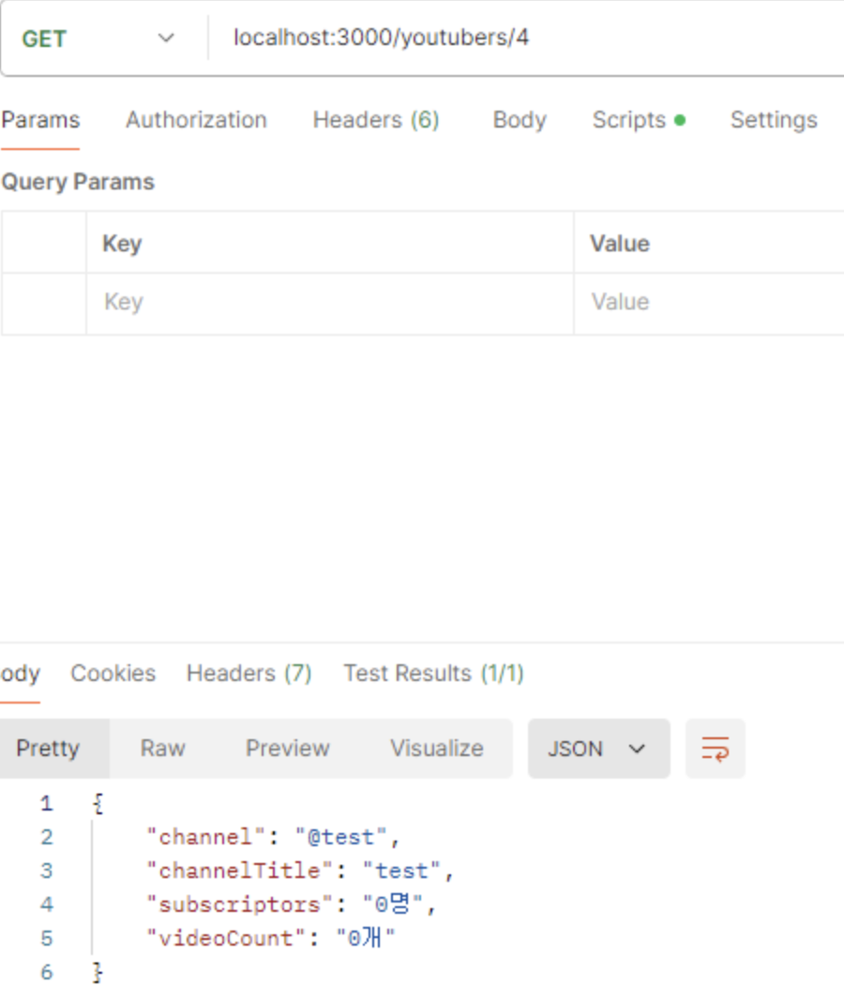
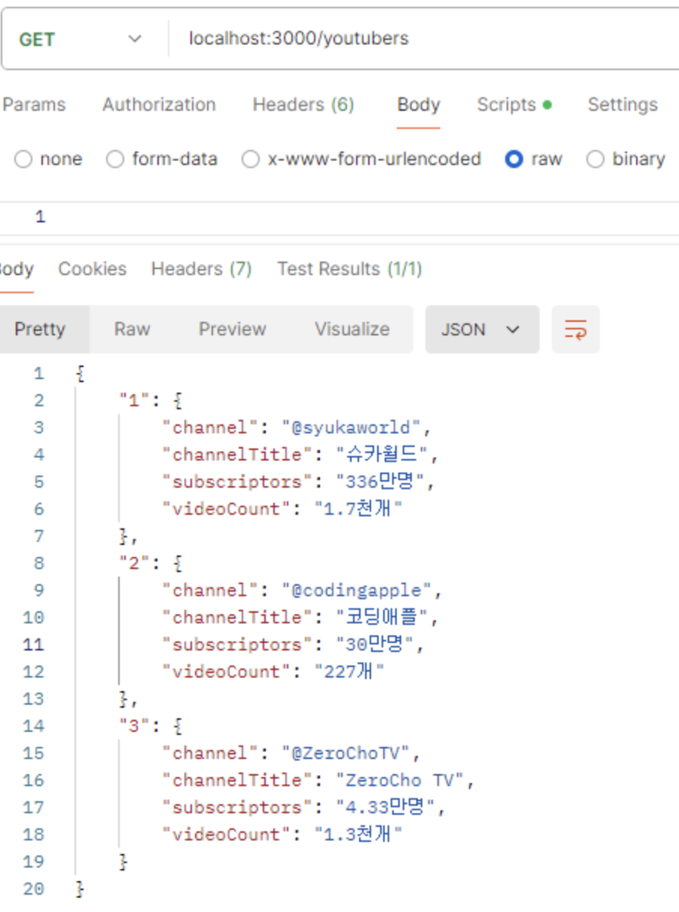

# Postman의 등장

일반적인 웹 브라우저에서 GET 요청은 쉽게 테스트할 수 있지만, POST 요청은 브라우저 상에서 쉽게 테스트할 수 없습니다. 이 문제를 해결하기 위해 우리는 Postman이라는 툴을 사용합니다. Postman은 API 요청을 손쉽게 테스트하고 디버깅할 수 있는 유용한 도구입니다.

# GET

GET 요청 테스트: Postman을 실행하고, 서버에 GET 요청을 보내보세요. 만약 정상적으로 동작한다면, 서버로부터 데이터를 성공적으로 받아올 것입니다.

# POST

POST 요청 테스트: POST 요청을 테스트하기 위해서는, Postman에서 요청의 메서드를 POST로 설정하고, Body에 필요한 데이터를 입력해야 합니다. 이를 통해 서버에 데이터를 전송하고 원하는 응답을 받을 수 있습니다.

# 유튜버 등록 실습

~~~javascript
const express = require("express");
const app = express();
app.listen(3000);
app.use(express.json());

const youtubers = new Map();
let id = 0;

youtubers.set(++id, {
    channel: "@syukaworld",
    channelTitle: "슈카월드",
    subscriptors: "336만명",
    videoCount: "1.7천개",
});
youtubers.set(++id, {
    channel: "@codingapple",
    channelTitle: "코딩애플",
    subscriptors: "30만명",
    videoCount: "227개",
});
youtubers.set(++id, {
    channel: "@ZeroChoTV",
    channelTitle: "ZeroCho TV",
    subscriptors: "4.33만명",
    videoCount: "1.3천개",
});

app.get("/", (req, res) => {
    res.json("Hello World");
});

app.get("/youtubers", (req, res) => {
    res.json(Object.fromEntries(youtubers)); // Map -> Object
});

app.get("/youtubers/:id", (req, res) => {
    const id = +req.params.id;
    if (youtubers.has(id)) {
        const youtuber = youtubers.get(id);
        res.json(youtuber);
    } else {
        res.status(404).send("해당 유튜버를 찾을 수 없습니다.");
    }
});

app.post("/youtubers", (req, res) => {
    youtubers.set(++id, req.body);
    res.json({
        message: `${req.body.channelTitle}님, 채널 개설을 환영합니다!`,
    });
});
~~~

