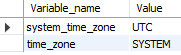
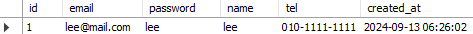
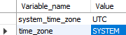
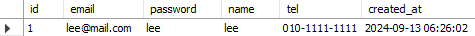
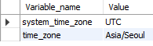
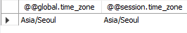
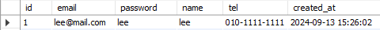

# MySQL과 TypeScript를 이용한 DB 연동 및 시간대 설정

## AUTO_INCREMENT 설정 및 초기화

`AUTO_INCREMENT` 키워드를 사용하는 컬럼의 값은 별도로 입력하지 않으면 자동으로 증가합니다. 하지만 직접 해당 컬럼에 값을 입력할 경우, 그 다음 값은 해당 컬럼에서 가장 큰 값에 +1이 더해져 시작합니다.

특징:

- 레코드를 삭제해도 `AUTO_INCREMENT` 카운트가 줄어들지 않습니다.
- `AUTO_INCREMENT` 값을 초기화하고 해당 컬럼의 값을 재조정하고 싶을 경우 아래와 같은 방법을 사용할 수 있습니다.

```sql
ALTER TABLE 테이블명 AUTO_INCREMENT = 1; -- AUTO_INCREMENT 값 초기화
SET @COUNT = 0;
UPDATE 테이블명 SET 컬럼명 = @COUNT := @COUNT + 1;
```

이 SQL 코드는 AUTO_INCREMENT 값을 초기화한 뒤, 각 레코드의 컬럼 값을 재조정하는 방식입니다.

## MySQL DB 연동

아래는 mysql2/promise 모듈을 사용하여 TypeScript에서 MySQL DB와 연동하는 코드입니다.

```typescript
import mysql, { RowDataPacket } from "mysql2/promise";

interface User extends RowDataPacket {
  id: number;
  email: string;
  password: string;
  name: string;
  tel: string;
  created_at: Date;
}

const connection = await mysql.createConnection({
  host: "localhost",
  password: "root",
  user: "root",
  database: "Youtube",
});

try {
  const [results, fields] = await connection.query<RowDataPacket[]>(
    `SELECT * FROM users`
  );
  const { id, email, password, name, tel, created_at } = results[0] as User;
  console.log(id, email, password, name, tel, created_at);
  console.log(results);
  console.log(fields);
} catch (err) {
  console.log(err);
}
```

## Time Zone 설정



MySQL 데이터베이스의 기본 system timezone은 UTC입니다. 즉, 타임스탬프가 저장될 때 UTC 시간을 기준으로 저장됩니다. 하지만 서버(Node.js)가 실행되는 환경에 따라 시간 차이가 발생할 수 있습니다.

현재 서버는 한국(Asia/Seoul)에 위치해 있으므로 UTC+9 타임존이 적용됩니다. 이를 데이터베이스와 동기화하기 위해 시간대를 변경하려면 아래와 같은 절차를 따릅니다.

### 1. Global Time Zone 설정

MySQL의 global time_zone을 변경하여 모든 데이터베이스에 적용합니다.

```sql
SET GLOBAL time_zone = 'Asia/Seoul';
```




이 명령어를 실행한 후에도 여전히 session.time_zone은 SYSTEM으로 설정되어 있을 수 있습니다. 이는 현재 접속 중인 세션에만 해당되는 문제입니다.

### Session Time Zone 설정

현재 세션의 타임존을 변경하려면 아래 명령어를 실행합니다.

```sql
SET time_zone = 'Asia/Seoul';
```





이렇게 하면 현재 세션에서 저장된 시간 역시 Asia/Seoul 기준으로 변경됩니다. 하지만 Node.js에서 조회할 때 여전히 global.time_zone 변수가 적용되어 시간 차이가 발생할 수 있습니다.

### dateString 설정

타임스탬프 조회 시 YYYY-MM-DD HH:MM:SS 형식의 문자열로 조회하고, 서버의 타임존에 맞춰 시간을 변경하려면 dateStrings 옵션을 활성화합니다.

```typescript
const connection = await mysql.createConnection({
  host: "localhost",
  password: "root",
  user: "root",
  database: "Youtube",
  dateStrings: true,
});
```

이를 통해 타임스탬프가 문자열 형식으로 반환되며, 서버의 타임존에 맞춰 9시간 증가한 시간을 확인할 수 있습니다.
