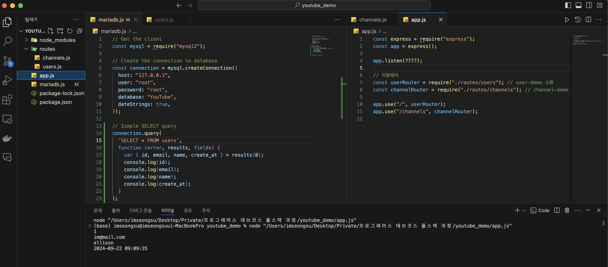

# 1. DB 모듈화

## DB 모듈화란?
DB 모듈화는 데이터베이스 연결 및 쿼리 실행을 위한 로직을 한 곳에 모아 모듈로 관리하는 방법입니다. 이를 통해 코드 재사용성을 높이고 유지보수를 쉽게 할 수 있습니다.

## 예시 코드 (MySQL2 또는 MariaDB)
```javascript
const mysql = require('mysql2/promise');

const pool = mysql.createPool({
    host: 'localhost',
    user: 'yourUsername',
    password: 'yourPassword',
    database: 'yourDatabase'
});

module.exports = pool;
```



## 장점
    •	코드 재사용성: 여러 파일에서 DB 연결을 재사용 가능.
	•	유지보수 용이성: DB 설정 변경 시 한 파일만 수정하면 됨.


# 2. GET - users DB 연동

## GET 요청으로 users 데이터 가져오기
Express 서버에서 `GET /users` API를 통해 데이터베이스의 `users` 테이블에서 모든 사용자를 조회합니다.

## 예시 코드
```javascript
const express = require('express');
const router = express.Router();
const pool = require('../mariadb');

router.get('/users', async (req, res) => {
    try {
        const conn = await pool.getConnection();
        const [users] = await conn.query('SELECT * FROM users');
        res.json(users);
        conn.release();
    } catch (err) {
        res.status(500).json({ error: err.message });
    }
});

module.exports = router;
```

## 장점

	•	비동기 처리: 데이터베이스 쿼리 후 응답을 비동기적으로 처리하여 서버의 성능을 향상.
	•	오류 처리: 오류 발생 시 클라이언트에 적절한 메시지를 반환.


# 3. 오류 해결 및 SELECT SQL 쿼리 형식

## 오류 해결 방법
쿼리 실행 시 발생할 수 있는 오류를 대비하여 적절히 처리합니다. 예를 들어, DB 연결 오류나 쿼리 실행 오류 등이 있을 수 있습니다.

## SELECT SQL 쿼리 예시
```sql
SELECT * FROM users WHERE id = ?;
```
예시 코드
```javascript
const [rows] = await conn.query('SELECT * FROM users WHERE id = ?', [userId]);
```

## 자주 발생하는 오류

	•	ER_BAD_DB_ERROR: 데이터베이스가 존재하지 않음.
	•	ER_PARSE_ERROR: SQL 문법 오류.


# 4. 회원가입 INSERT

## 회원가입을 위한 데이터베이스 INSERT
회원 정보를 받아 데이터베이스의 `users` 테이블에 새로운 사용자를 추가합니다.

## 예시 코드
```javascript
router.post('/users', async (req, res) => {
    const { email, name, password } = req.body;
    try {
        const conn = await pool.getConnection();
        const result = await conn.query('INSERT INTO users (email, name, password) VALUES (?, ?, ?)', [email, name, password]);
        res.status(201).json({ id: result.insertId });
        conn.release();
    } catch (err) {
        res.status(500).json({ error: err.message });
    }
});
```

## 주의할 점

	•	입력 값 유효성 검사: 이메일, 비밀번호 등의 유효성을 검사해야 함.
	•	에러 처리: 중복된 이메일이나 잘못된 입력값에 대한 처리 필요.


# 5. DELETE 및 로그인

## 회원 삭제
사용자를 삭제하는 DELETE 요청을 처리합니다.

## DELETE 예시 코드
```javascript
router.delete('/users/:id', async (req, res) => {
    const userId = req.params.id;
    try {
        const conn = await pool.getConnection();
        await conn.query('DELETE FROM users WHERE id = ?', [userId]);
        res.status(200).json({ message: 'User deleted' });
        conn.release();
    } catch (err) {
        res.status(500).json({ error: err.message });
    }
});
```

## 로그인 예시 코드
```javascript
router.post('/login', async (req, res) => {
    const { email, password } = req.body;
    try {
        const conn = await pool.getConnection();
        const [user] = await conn.query('SELECT * FROM users WHERE email = ? AND password = ?', [email, password]);
        if (user.length > 0) {
            res.status(200).json({ message: 'Login successful' });
        } else {
            res.status(401).json({ message: 'Invalid credentials' });
        }
        conn.release();
    } catch (err) {
        res.status(500).json({ error: err.message });
    }
});
```


# 6. users.js 코드 정리 - 리팩토링

## 리팩토링이란?
리팩토링은 코드의 기능은 유지하면서 코드의 구조를 개선하는 과정입니다. 가독성을 높이고, 중복을 제거하며, 유지보수성을 향상시키는 것을 목표로 합니다.

## 리팩토링 전 코드
- 중복된 DB 연결 로직.
- 에러 핸들링이 일관되지 않음.

## 리팩토링 후 코드
DB 연결과 에러 핸들링을 함수로 분리하여 코드 가독성을 높입니다.

### 리팩토링된 예시 코드
```javascript
async function queryDatabase(sql, params) {
    try {
        const conn = await pool.getConnection();
        const [rows] = await conn.query(sql, params);
        conn.release();
        return rows;
    } catch (err) {
        throw err;
    }
}

// 회원 목록 가져오기
router.get('/users', async (req, res) => {
    try {
        const users = await queryDatabase('SELECT * FROM users');
        res.json(users);
    } catch (err) {
        res.status(500).json({ error: err.message });
    }
});
```


# 7. channels.js

## 채널 API 구현
`channels.js`는 채널 관련 CRUD 기능을 담당하는 라우터입니다.

## 채널 목록 가져오기
```javascript
router.get('/channels', async (req, res) => {
    try {
        const channels = await queryDatabase('SELECT * FROM channels');
        res.json(channels);
    } catch (err) {
        res.status(500).json({ error: err.message });
    }
});
```

## 채널 생성
```javascript
router.post('/channels', async (req, res) => {
    const { name } = req.body;
    try {
        await queryDatabase('INSERT INTO channels (name) VALUES (?)', [name]);
        res.status(201).json({ message: 'Channel created' });
    } catch (err) {
        res.status(500).json({ error: err.message });
    }
});
```

## 채널 삭제
```javascript
router.delete('/channels/:id', async (req, res) => {
    const channelId = req.params.id;
    try {
        await queryDatabase('DELETE FROM channels WHERE id = ?', [channelId]);
        res.status(200).json({ message: 'Channel deleted' });
    } catch (err) {
        res.status(500).json({ error: err.message });
    }
});
```