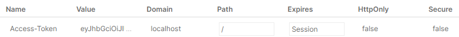

# 1. Express의 next() 함수

## 설명

Express에서 `get`, `post`, `put`, `delete` 등의 메서드에 전달되는 콜백 함수는 세 가지 매개변수를 가집니다: `req`, `res`, `next`. 이 중 `next`는 현재 미들웨어가 완료되었을 때 다음 미들웨어를 호출하는 역할을 합니다.

## 예시 코드

```javascript
function checkValidation(req, res, next) {
  const err = validationResult(req);
  if (err.isEmpty()) {
    next(); // 다음 미들웨어 호출
  } else {
    return res.status(400).json(err.array()); // 에러 응답 반환
  }
}
```

## 요약

next() 함수는 미들웨어 체인에서 다음 함수로 넘어가게 하며, 중간에 중단하지 않고 여러 미들웨어를 연결하여 처리할 수 있도록 합니다.

# 2. 인증(Authentication)과 인가(Authorization)

## 인증(Authentication)

인증은 사용자가 자신이 누구인지 증명하는 과정입니다. 예를 들어, 사용자가 로그인 폼에 아이디와 비밀번호를 입력하면 서버는 이 정보를 확인하고 사용자가 등록된 사용자임을 증명합니다.

## 인가(Authorization)

인가란 권한 부여를 의미합니다. 인증된 사용자가 어떤 자원에 접근할 수 있는지, 어떤 작업을 수행할 수 있는지를 결정하는 과정입니다. 예를 들어, 관리자와 일반 사용자가 다른 권한을 가질 수 있습니다.

### 인증과 인가의 차이

- **인증**: 사용자가 누구인지 확인
- **인가**: 사용자가 무엇을 할 수 있는지 결정

# 3. 쿠키(Cookie)

## 설명

쿠키는 서버가 클라이언트에게 전송하고, 클라이언트(브라우저)가 저장한 데이터를 의미합니다. 사용자가 동일한 서버를 다시 방문할 때 쿠키에 저장된 정보를 사용하여 상태를 유지할 수 있습니다.

## 장점

- 서버가 사용자의 상태를 저장하지 않아도 되며, 서버의 저장 공간을 절약할 수 있습니다.
- 로그인 상태 등의 정보를 쿠키에 저장해, 사용자가 다시 방문할 때 자동으로 로그인 상태를 유지할 수 있습니다.

## 단점

- 쿠키는 보안에 취약하며, 자바스크립트로 쉽게 접근할 수 있기 때문에 `HttpOnly` 옵션을 설정하여 쿠키에 접근하지 못하게 해야 합니다.

## 예시 코드 (쿠키 설정)

```javascript
res.cookie("token", token, { httpOnly: true, secure: true });
```

# 4. 세션(Session)

## 설명

세션은 서버 측에서 사용자의 상태를 저장하는 방식입니다. 세션은 특정 상태를 의미하며, 주로 로그인 세션이 가장 많이 사용됩니다. 세션은 서버에 저장되며, 해당 세션 ID는 쿠키를 통해 클라이언트와 주고받습니다.

## 장점

- 서버 측에서 상태를 관리하기 때문에 보안성이 높습니다.

## 단점

- 세션은 서버의 저장 공간을 사용하므로 서버의 부담이 있습니다.

## 예시 코드

```javascript
req.session.user = { id: userId, name: userName };
```

# 5. JWT (JSON Web Token)

## 설명

JWT는 JSON 형태의 데이터를 암호화하여 웹에서 토큰으로 사용하는 방식입니다. 주로 인증과 인가에 사용되며, 서버는 상태를 저장하지 않고도 사용자의 권한을 관리할 수 있습니다.

## JWT 구조

1. **헤더(Header)**: 토큰의 타입과 암호화 알고리즘 정보.
2. **페이로드(Payload)**: 실제 데이터(사용자 정보 등).
3. **서명(Signature)**: 데이터 위변조 방지를 위한 서명.

## 장점

- 서버가 상태를 저장하지 않아도 되므로 서버의 부담이 줄어듭니다.
- 데이터가 암호화되어 있기 때문에 보안성이 높습니다.

## 예시 코드

```javascript
const token = jwt.sign(payload, secretKey, { expiresIn: "30m" });
res.setHeader("Access-Token", token);
```



## JWT 사용법

- 서명: jwt.sign(payload, secretKey)를 사용하여 토큰을 생성.
- 검증: jwt.verify(token, secretKey)를 사용하여 토큰을 검증.

# 6. 쿠키와 JWT 연동

## 쿠키에 JWT 저장

JWT는 일반적으로 HTTP 헤더에 저장되지만, 쿠키에도 저장할 수 있습니다. 이 방식은 보안 측면에서 이점을 가집니다.

## 예시 코드 (JWT를 쿠키에 저장)

```javascript
res.cookie("token", token, { httpOnly: true, secure: true });
```

- HttpOnly: 클라이언트 측 자바스크립트가 쿠키에 접근할 수 없도록 제한하여 보안을 강화합니다.
- Secure: HTTPS를 사용하는 경우에만 쿠키를 전송합니다.

## 쿠키에서 JWT 읽기

```javascript
const token = req.cookies.token;
```

# 7. 환경 변수 관리 (.env 파일)

## .env 파일이란?

`.env` 파일은 서버 설정, API 키 등 외부로 노출되면 안 되는 민감한 정보를 저장하는 파일입니다. 이 파일을 사용하면 코드에 민감한 정보를 하드코딩하지 않고 환경 변수로 관리할 수 있습니다.

## .env 파일 예시

```env
PRIVATE_KEY=your_private_key
DATABASE_URL=your_database_url
```

## 사용법

- .env 파일을 프로젝트 루트에 생성.
- dotenv 패키지 설치 후 dotenv.config()로 설정.

```javascript
require("dotenv").config();
console.log(process.env.PRIVATE_KEY);
```

## package.json을 이용한 실행 방법

```json
"scripts": {
    "start": "node --env-file=.env app.js"
}
```
